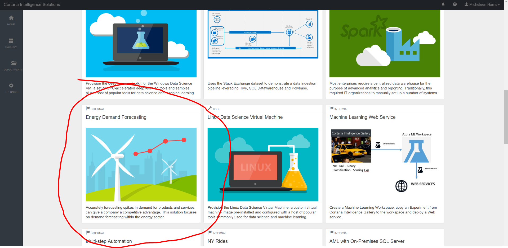

## Pre-Work for Instructor-Led Class

After, you have ensured your Azure account has the Azure credits given in the Passes for the instructor-led format or enough for 4 days of use (Standard tiers for:  App Services, Streaming Analytics, Event Hubs, SQL DB, Data Factory, SQL Server) AND that you have been "whitelisted" (instructions found [here](PREREQUISITES.md)) plesae do the following:

1.  Make sure you can access https://start.cortanaintelligence.com.  When there, ensure that you can:
  * Navigate to "DEPLOYMENTS"
  * Click on "+New" button in upper right corner
  * See the small "More" link at the bottom left
  * After clicking on "More", ensure you can see the "Energy Demand Forecasting" solution template card (about 1/2 of the way down the page)

Congratulations, you are ready to take this course as instructor-led!
